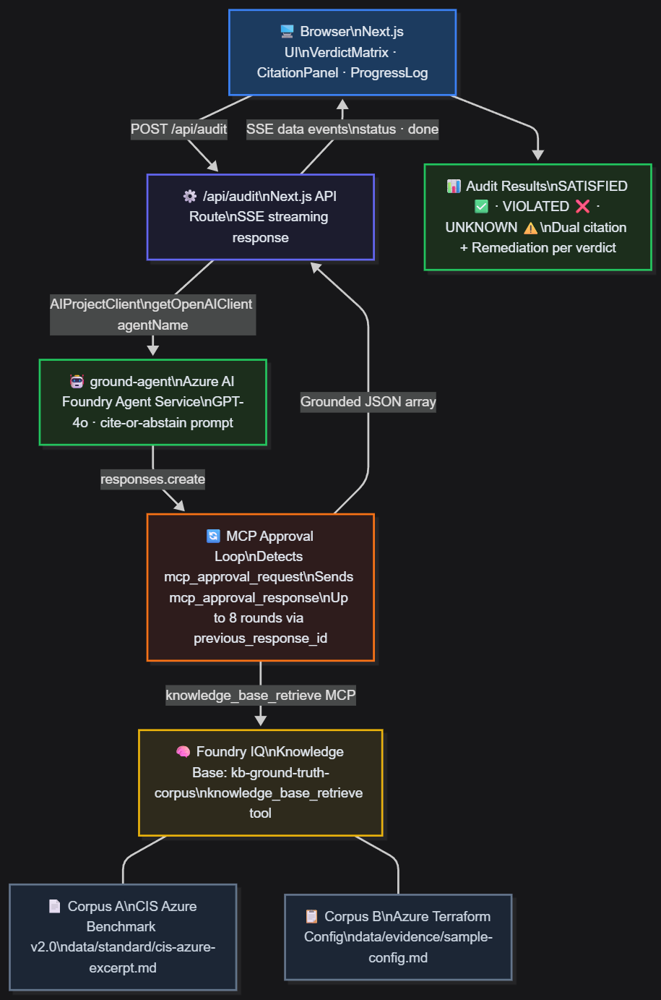

# Ground Truth

> **Microsoft Agents League 2026 — Reasoning Agents track**
> An AI agent that audits cloud security posture against the CIS Azure Benchmark — grounded, cited, and honest enough to say "I don't know."

---

## The problem

Every cloud security scanner produces a verdict. Most of them guess.

Ground Truth refuses. If the evidence isn't in the corpus, the verdict is **UNKNOWN** — not SATISFIED, not VIOLATED. The abstain path is a feature, not a failure.

## What it does

Ground Truth ingests a security standard and a cloud infrastructure configuration, then produces a per-control verdict for every rule with full citations:

| Verdict | Meaning |
|---|---|
| ✅ SATISFIED | Evidence found that the control is met — standard clause + config line both cited |
| ❌ VIOLATED | Evidence found of a breach — standard clause + config line + remediation cited |
| ⚠️ UNKNOWN | No grounded evidence found — agent abstains rather than fabricating a verdict |

Every verdict links directly to the source: the exact CIS clause number and the exact Terraform line that proves or disproves compliance.

## Demo

[Demo video →](#) *(link added at submission)*

## Architecture

```
Browser (Next.js)
    │  SSE stream — live progress as agent works
    ▼
/api/audit  (Next.js route)
    │
    ▼
Azure AI Foundry Agent Service  ←── ground-agent
    │
    ├─ responses.create (OpenAI Responses API)
    │       │
    │       ▼
    │  MCP approval loop
    │  Agent requests knowledge_base_retrieve →
    │  Server approves → Agent retrieves cited chunks
    │       │
    │       ▼
    │  Cite-or-abstain adjudication
    │  SATISFIED / VIOLATED: dual citation required
    │  UNKNOWN: mandatory when evidence absent
    │
    ▼
Foundry IQ  (knowledge base: kb-ground-truth-corpus)
    ├─ Corpus A: data/standard/cis-azure-excerpt.md   — CIS Azure Benchmark v2.0 excerpt
    └─ Corpus B: data/evidence/sample-config.md       — Terraform IaC evidence
```



See [docs/architecture.md](docs/architecture.md) for the full annotated diagram.

## How Foundry IQ is used

The agent's knowledge base (`kb-ground-truth-corpus`) is backed by two corpora uploaded to Foundry IQ:

- **Standard corpus** — selected CIS Azure Benchmark v2.0 controls (§3, §4, §6)
- **Evidence corpus** — a Terraform IaC configuration with intentional security posture variations

At runtime the agent calls `knowledge_base_retrieve` (MCP) to search both corpora. The server approves each retrieval in a loop. The agent **must** return citations or abstain — it cannot produce SATISFIED or VIOLATED without grounded evidence from the knowledge base.

## Tech stack

| Component | Technology |
|---|---|
| Agent runtime | Azure AI Foundry Agent Service |
| Grounding layer | **Foundry IQ** (knowledge base + MCP retrieval) |
| Reasoning model | Azure OpenAI GPT-4o |
| Orchestration SDK | `@azure/ai-projects` v2.2.0 |
| UI | Next.js 15, Tailwind CSS |
| Development | GitHub Copilot |

## Repo structure

```
data/
  standard/     — CIS Azure Benchmark excerpt (Foundry IQ corpus A)
  evidence/     — Sample Azure Terraform config (Foundry IQ corpus B)
ui/
  app/api/audit/route.ts   — SSE streaming audit endpoint
  components/
    VerdictMatrix.tsx       — Live audit matrix with progress log
    CitationPanel.tsx       — Per-verdict citation modal
    ProgressLog.tsx         — Real-time agent progress stream
  lib/types.ts             — AuditResult type
docs/
  architecture.md          — Full architecture diagram
agent/
  prompts/                 — Agent system prompts (extractor, adjudicator, remediator)
```

## Running locally

### Prerequisites

- Node.js 18+
- Azure AI Foundry project with:
  - A deployed GPT-4o model
  - A Foundry Agent named `ground-agent` with both corpus files attached as a knowledge base
  - `DefaultAzureCredential` configured (`az login` is sufficient locally)

### Setup

```bash
cd ui
npm install
cp .env.example .env.local
# Fill in .env.local with your Foundry endpoint, project name, and agent name
npm run dev
```

### Environment variables

```
AZURE_AI_FOUNDRY_ENDPOINT=https://<your-resource>.services.ai.azure.com
AZURE_AI_PROJECT_NAME=<your-project-name>
AZURE_AGENT_NAME=ground-agent
AZURE_OPENAI_DEPLOYMENT=gpt-4o
```

### Running an audit

1. Open `http://localhost:3000`
2. Click **Run Audit** — the progress log shows each agent step in real time
3. Click any row in the verdict matrix to view citations
4. Click **Export Report** to download the full audit as JSON

## Submission

- **Track:** Reasoning Agents
- **Primary prize target:** Best use of IQ
- **IQ layer:** Foundry IQ (knowledge base + cited MCP retrieval)
- **Demo video:** [link TBD]
- **Architecture diagram:** [docs/architecture.md](docs/architecture.md)
